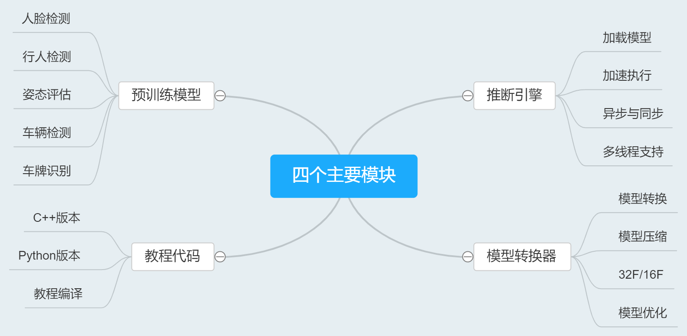
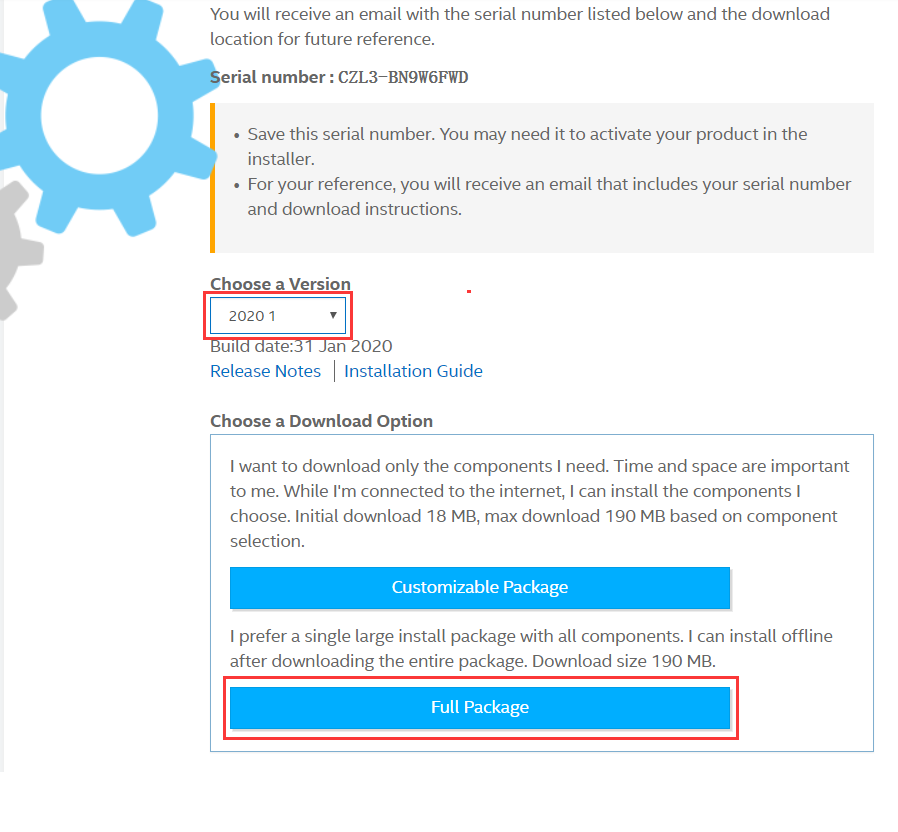

<!--
 * @描述: OpenVINO 学习笔记
 * @版本: V1_0
 * @作者: LiWanglin
 * @创建时间: 2020.03.02
 * @最后编辑人: LiWanglin
 * @最后编辑时间: 2020.03.02
 -->

# OpenVINO 学习笔记

## 一. OpenVINO 介绍

- 本节主要介绍 OpenVINO ，包括 OpenVINO 简介，OpenVINO 的组成等。

### 1.1 OpnVINO 简介

- OpenVINO 是英特尔基于自身现有的硬件平台开发的一种可以加快高性能计算机视觉和深度学习视觉应用开发速度工具套件，支持各种英特尔平台的硬件加速器上进行深度学习，并且允许直接异构执行。
- OpenVINO 工具包可通过基于英特尔架构的处理器（ CPU ）及核显（ Integrated GPU ）和深度学习加速器（ FPGA、Movidius VPU ）的深度学习加速芯片，增强视觉系统功能和性能。

### 1.2 OpenVINO 组成

- OpenVINO 主要由四个模块组成，分别是：推断引擎，模型优化器，预训练模型，数据代码。

## 二. OpenVINO 环境配置

- 本节主要讲解如何配置 OpenVINO ，包括如何安装 OpenVINO 以及如何在 VS2019 配置 OpenVINO 的开发环境。

### 2.1 安装 OpenVINO

- 安装 OpenVINO 主要步骤有：下载 OpenVINO

(1) 下载 OpenVINO

- 进入网站：[OpenVINO](https://software.seek.intel.com/openvino-toolkit?os=windows)，下载OpenVINO ，如果要注册才能下载，那先注册。选择 2019.R3 版本和 Full Package 下载。

(2) 安装 OpenVINO 工具包

### 2.2 基于 VS2019 的开发环境配置