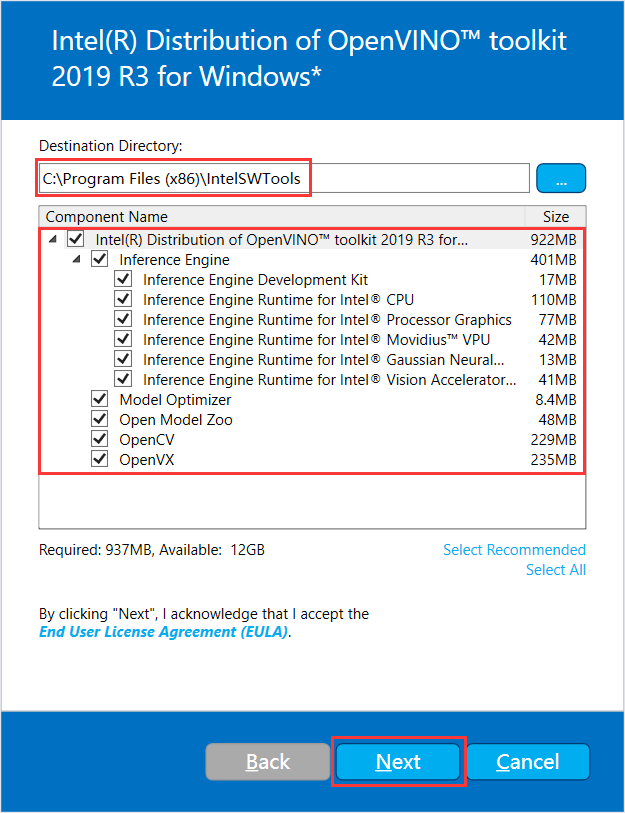
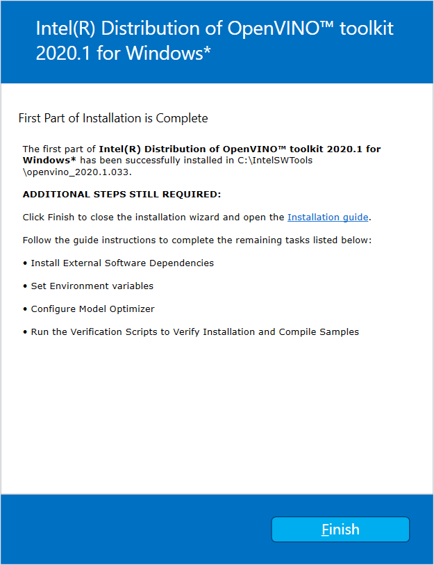
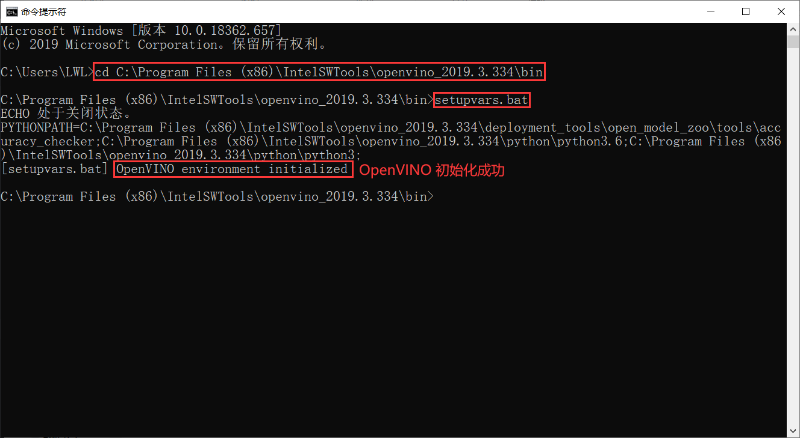
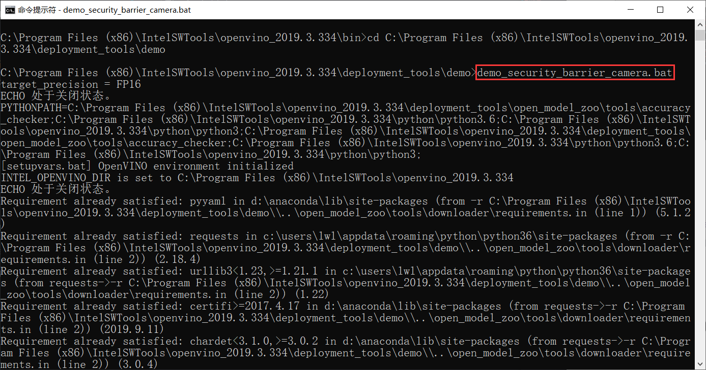
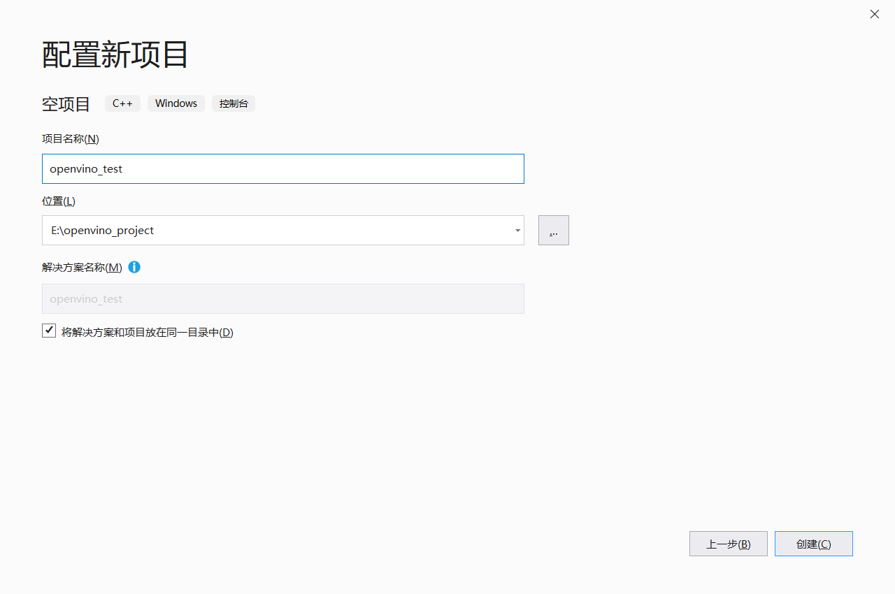
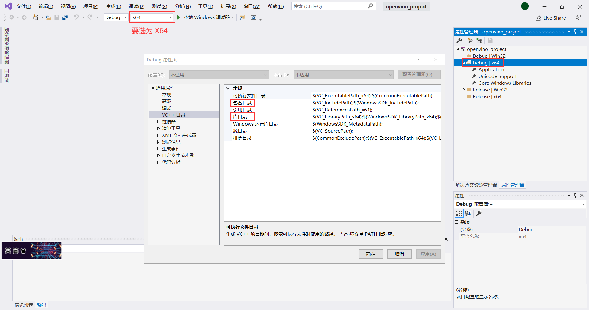

<!--
 * @描述: OpenVINO 学习笔记
 * @版本: V1_0
 * @作者: LiWanglin
 * @创建时间: 2020.03.02
 * @最后编辑人: LiWanglin
 * @最后编辑时间: 2020.03.02
 -->

# OpenVINO 学习笔记

## 一. OpenVINO 介绍

- 本节主要介绍 OpenVINO ，包括 OpenVINO 简介，OpenVINO 的组成等。

### 1.1 OpnVINO 简介

- OpenVINO 是英特尔基于自身现有的硬件平台开发的一种可以加快高性能计算机视觉和深度学习视觉应用开发速度工具套件，支持各种英特尔平台的硬件加速器上进行深度学习，并且允许直接异构执行。
- OpenVINO 工具包可通过基于英特尔架构的处理器（ CPU ）及核显（ Integrated GPU ）和深度学习加速器（ FPGA、Movidius VPU ）的深度学习加速芯片，增强视觉系统功能和性能。

### 1.2 OpenVINO 组成

- OpenVINO 主要由四个模块组成，分别是：推断引擎，模型优化器，预训练模型，数据代码。


## 二. OpenVINO 环境配置

- 本节主要讲解如何配置 OpenVINO ，包括如何安装 OpenVINO 以及如何在 VS2019 配置 OpenVINO 的开发环境。

### 2.1 准备工作

- 在安装 OpenVINO 工具包之前，需安装一下软件:
  - VS2015/VS2017/VS2019
  - CMake 3.4 及以上版本（如果是 VS2019 ，需安装 CMake 3.14 版本或更高）
  - Python 3.6.5 以上

- 我的软件安装版本:
  - VS2019 社区版
  - CMake 3.16.0
  - Python 3.6.9

### 2.2 安装以及配置 OpenVINO

- 安装 OpenVINO 主要步骤有：下载 OpenVINO ，安装 OpenVINO 工具包，初始化 OpenVINO ，运行测试 Demo

(1) 下载 OpenVINO

- 进入网站：[OpenVINO](https://software.seek.intel.com/openvino-toolkit?os=windows)，下载OpenVINO ，如果要注册才能下载，那先注册。选择 2019.R3 版本和 Full Package 下载。


(2) 安装 OpenVINO 工具包

- 下载完 OpenVINO ，双击软件包，进入安装页面
- 注意安装路径以及选择全部的组件，然后一路点击 Next，最后点击 Finsh，组件安装完成。

(3) 初始化 OpenVINO

- 打开 CMD ，然后进入以下目录

    ```C++
    C:\Program Files (x86)\IntelSWTools\openvino_2019.3.334\bin
    ```

- 输入 setupvars.bat ，执行初始化脚本


(4) 运行测试 Demo

- 进入以下目录

    ```C++
    C:\Program Files (x86)\IntelSWTools\openvino_2019.3.334\deployment_tools\demo
    ```

- 输入 demo_security_barrier_camera.bat ，执行测试脚本


- 如果 OpenVINO 安装成功，则会出现以下结果


### 2.3 基于 VS2019 的开发环境配置

- 要想在 VS2019 上使用 OPenVINO 进行加速优化，我们需要进行一系列的配置，包括：配置 VC++ 的包含目录，VC++ 的库目录，

(1) 新建项目

- 打开 VS2019 ，点击创建新项目，然后创建一个空项目。这里，我创建的项目名称为：openvino_project 。


(2) 设置 VS++ 目录

- 在 VS2019 里面点击视图，然后点击其他窗口，再点击属性管理器。点击完成后，我们可以在右侧小窗口中看到属性管理器窗口。

- 然后在属性管理器窗口中双击 Debug|x64 ，进入 Debug 属性页。然后点击 VC++ 目录。接后，我们主要设置 **包含目录** 和 **库目录** 。
