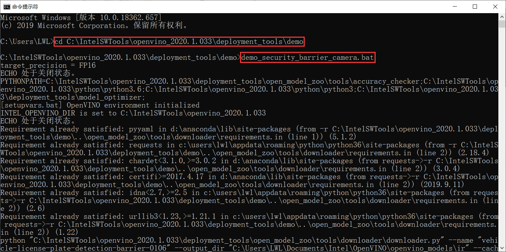

<!--
 * @描述: OpenVINO 学习笔记
 * @版本: V1_0
 * @作者: LiWanglin
 * @创建时间: 2020.03.02
 * @最后编辑人: LiWanglin
 * @最后编辑时间: 2020.03.09
 -->

# OpenVINO 学习笔记

## 一. OpenVINO 介绍

- 本节主要介绍 OpenVINO ，包括 OpenVINO 简介，OpenVINO 的组成等。

### 1.1 OpnVINO 简介

- OpenVINO 是英特尔基于自身现有的硬件平台开发的一种可以加快高性能计算机视觉和深度学习视觉应用开发速度工具套件，支持各种英特尔平台的硬件加速器上进行深度学习，并且允许直接异构执行。
- OpenVINO 工具包可通过基于英特尔架构的处理器（ CPU ）及核显（ Integrated GPU ）和深度学习加速器（ FPGA、Movidius VPU ）的深度学习加速芯片，增强视觉系统功能和性能。

### 1.2 OpenVINO 组成

- OpenVINO 工具包组件：


## 二. OpenVINO 入门

- 本节主要讲解 OpenVINO 的入门操作，包括如何安装并配置 OpenVINO ，如何运行 OpenVINO 的 Demo 以及如何在 VS2017 配置 OpenVINO 的开发环境。

### 2.1 准备工作

- 在安装 OpenVINO 工具包之前，需安装一下软件:
  - VS2015/VS2017/VS2019
  - CMake 3.4 及以上版本（如果是 VS2019 ，需安装 CMake 3.14 版本或更高）
  - Python 3.6.5 以上

- 我的软件安装版本:
  - VS2017 社区版
  - CMake 3.16.0
  - Python 3.6.9

### 2.2 安装以及配置 OpenVINO

- 安装 OpenVINO 主要步骤有：下载 OpenVINO ，安装 OpenVINO 工具包，初始化 OpenVINO ，运行测试 Demo

(1) 下载 OpenVINO

- 进入网站：[OpenVINO](https://software.seek.intel.com/openvino-toolkit?os=windows)，下载OpenVINO ，如果要注册才能下载，那先注册。选择 2020 1 版本和 Full Package 下载。


(2) 安装 OpenVINO 工具包

- 下载完 OpenVINO ，双击软件包，进入安装页面
- 注意安装路径以及选择的组件，然后一路点击 Next，最后点击 Finsh，组件安装完成。

(3) 初始化 OpenVINO

- 打开 CMD ，然后进入以下目录

    ```C++
    C:\IntelSWTools\openvino_2020.1.033\bin
    ```

- 输入 setupvars.bat ，执行初始化脚本


(4) 运行测试 Demo

- 进入以下目录

    ```C++
    C:\IntelSWTools\openvino_2020.1.033\deployment_tools\demo
    ```

- 输入 demo_security_barrier_camera.bat ，执行测试脚本


- 如果 OpenVINO 安装成功，则会出现以下结果


### 2.3 执行 OpenVINO Demos

- 在 open_model_zoo 文件夹下，OpenVINO 给我们提供了许多 Demo ，今天我们就来学习怎么让这些 Demo 运行起来。

(1) 编译 build_demos_msvc.bat 文件

- 打开 cmd ，进入以下目录：

  ```C++
  C:\IntelSWTools\openvino_2020.1.033\deployment_tools\inference_engine\demos
  ```

- 输入 build_demos_msvc.bat ，执行脚本文件


(2) 编译项目文件

- 执行完脚本之后，会在文档目录下生成一个 Intel 的文件夹。进入 Intel 文件夹下的 OpenVINO\omz_demos_build 文件夹，使用 VS2017 打开 Demos.sln 文件。

- 进入 VS2017 后，右键点击 ALL_BUILD ，然后点击生成，开始进行编译

- 编译完成之后，会在以下目录生成编译的文件

  ```C++
  C:\Users\LWL\Documents\Intel\OpenVINO\omz_demos_build\intel64\Debug
  ```

- 在 Debug 文件夹里，我们可以看到生成的 Demo exe 文件


(3) 设置环境变量

- 这次我们要执行的 dmeo 是：human_pose_estimation_demo.exe 。但是在执行 exe 文件前，我们必须要设置环境变量。

- 添加以下文件目录到环境变量。如果不添加，会提示缺少 xxx.dll 文件

  ```C++
  C:\IntelSWTools\openvino_2020.1.033\opencv\bin
  C:\Users\LWL\Documents\Intel\OpenVINO\omz_demos_build\intel64\Debug
  C:\Users\LWL\Documents\Intel\OpenVINO\omz_demos_build\intel64\Release
  C:\IntelSWTools\openvino_2020.1.033\deployment_tools\inference_engine\bin\intel64\Debug
  C:\IntelSWTools\openvino_2020.1.033\deployment_tools\inference_engine\bin\intel64\Release
  C:\IntelSWTools\openvino_2020.1.033\deployment_tools\inference_engine\external\tbb\bin
  C:\IntelSWTools\openvino_2020.1.033\deployment_tools\ngraph\lib
  ```

  

- 有些可能路径不同，具体看自己的目录。

(4) 下载模型文件

- 在执行 demo 前，我们必须先要下载模型文件，才能执行对应的 demo 。
- 进入以下目录，我们可以看到一个 downloader.py 文件。这个文件就是用来下载模型文件的。

  ```C++
  C:\IntelSWTools\openvino_2020.1.033\deployment_tools\tools\model_downloader
  ```
  
  

- 想要下载模型文件，我们只要在 cmd 下，输入

  ```C++
  python C:\IntelSWTools\openvino_2020.1.033\deployment_tools\intel_models\downloader.py --name <model_name>
  ```

- 具体的模型名可以到以下目录查看

  ```C++
  C:\IntelSWTools\openvino_2020.1.033\deployment_tools\intel_models
  ```

  

- 由于我们要执行的 demo 是 human_pose_estimation_demo.exe ，所以我们需要下载 human-pose-estimation-0001 模型。
- 在 cmd 里面输入一下命令，完成模型下载

  ```C++
  python C:\IntelSWTools\openvino_2020.1.033\deployment_tools\tools\model_downloader\downloader.py --name human-pose-estimation-0001
  ```

  

- 下载完成之后，会在 C:\Intel 文件夹下看到模型文件（具体路径，请自己看下载模型时的打印信息）


(5) 执行 human_pose_estimation_demo.exe

- 在上面步骤完成之后，我们就可以执行 human_pose_estimation_demo.exe 文件了。
- 打开 cmd 进入以下目录

  ```C++
  C:\Users\LWL\Documents\Intel\OpenVINO\omz_demos_build\intel64\Debug
  ```

- 输入以下命令

  ```C++
  human_pose_estimation_demo.exe -i C:\Users\LWL\Desktop\sample-videos-master\classroom.mp4 -m C:\Users\LWL\Desktop\human-pose-estimation-0001.xml -d CPU
  ```
  
  

- -i 参数默认为 cam，使用摄像头作为输入。也可以在 -i 后面加视频文件路径，使用视频输入。
- -m 参数为模型文件下的 xml 文件。
- -d 参数为使用执行的设备，这里使用 CPU 来执行。
