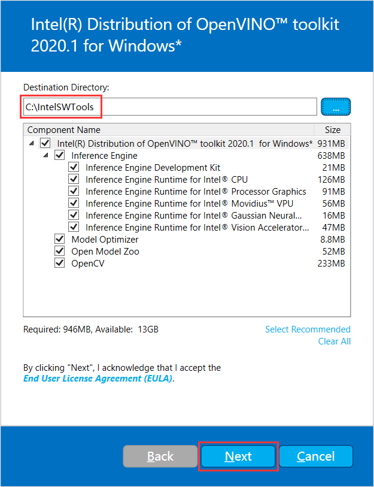

<!--
 * @描述: OpenVINO 学习笔记
 * @版本: V1_0
 * @作者: LiWanglin
 * @创建时间: 2020.03.02
 * @最后编辑人: LiWanglin
 * @最后编辑时间: 2020.03.09
 -->

# OpenVINO 学习笔记

## 一. OpenVINO 介绍

- 本节主要介绍 OpenVINO ，包括 OpenVINO 简介，OpenVINO 的组成等。

### 1.1 OpnVINO 简介

- OpenVINO 是英特尔基于自身现有的硬件平台开发的一种可以加快高性能计算机视觉和深度学习视觉应用开发速度工具套件，支持各种英特尔平台的硬件加速器上进行深度学习，并且允许直接异构执行。
- OpenVINO 工具包可通过基于英特尔架构的处理器（ CPU ）及核显（ Integrated GPU ）和深度学习加速器（ FPGA、Movidius VPU ）的深度学习加速芯片，增强视觉系统功能和性能。

### 1.2 OpenVINO 组成

- OpenVINO 工具包组件：


## 二. OpenVINO 入门

- 本节主要讲解 OpenVINO 的入门操作，包括如何安装并配置 OpenVINO ，如何运行 OpenVINO 的 Demo 以及如何在 VS2017 配置 OpenVINO 的开发环境。

### 2.1 准备工作

- 在安装 OpenVINO 工具包之前，需安装一下软件:
  - VS2015/VS2017/VS2019
  - CMake 3.4 及以上版本（如果是 VS2019 ，需安装 CMake 3.14 版本或更高）
  - Python 3.6.5 以上

- 我的软件安装版本:
  - VS2017 社区版
  - CMake 3.16.0
  - Python 3.6.9

### 2.2 安装以及配置 OpenVINO

- 安装 OpenVINO 主要步骤有：下载 OpenVINO ，安装 OpenVINO 工具包，初始化 OpenVINO ，运行测试 Demo

(1) 下载 OpenVINO

- 进入网站：[OpenVINO](https://software.seek.intel.com/openvino-toolkit?os=windows)，下载OpenVINO ，如果要注册才能下载，那先注册。选择 2020 1 版本和 Full Package 下载。


(2) 安装 OpenVINO 工具包

- 下载完 OpenVINO ，双击软件包，进入安装页面
- 注意安装路径以及选择的组件，然后一路点击 Next，最后点击 Finsh，组件安装完成。

(3) 初始化 OpenVINO

- 打开 CMD ，然后进入以下目录

    ```C++
    C:\IntelSWTools\openvino_2020.1.033\bin
    ```

- 输入 setupvars.bat ，执行初始化脚本


(4) 运行测试 Demo

- 进入以下目录

    ```C++
    C:\IntelSWTools\openvino_2020.1.033\deployment_tools\demo
    ```

- 输入 demo_security_barrier_camera.bat ，执行测试脚本


- 如果 OpenVINO 安装成功，则会出现以下结果


### 2.3 执行 OpenVINO Demos

- 在 open_model_zoo 文件夹下，OpenVINO 给我们提供了许多 Demo ，今天我们就来学习怎么让这些 Demo 运行起来。

(1) 编译 build_demos_msvc.bat 文件

- 打开 cmd ，进入以下目录：

  ```C++
  C:\IntelSWTools\openvino_2020.1.033\deployment_tools\inference_engine\demos
  ```

- 输入 build_demos_msvc.bat ，执行脚本文件


(2) 编译项目文件

- 执行完脚本之后，会在文档目录下生成一个 Intel 的文件夹。进入 Intel 文件夹下的 OpenVINO\omz_demos_build 文件夹，使用 VS2017 打开 Demos.sln 文件。

- 进入 VS2017 后，右键点击 ALL_BUILD ，然后点击生成，开始进行编译

- 编译完成之后，会在以下目录生成编译的文件

  ```C++
  C:\Users\LWL\Documents\Intel\OpenVINO\omz_demos_build\intel64\Debug
  ```

- 在 Debug 文件夹里，我们可以看到生成的 Demo exe 文件


(3) 设置环境变量

- 这次我们要执行的 dmeo 是：human_pose_estimation_demo.exe 。但是在执行 exe 文件前，我们必须要设置环境变量。

- 添加以下文件目录到环境变量。如果不添加，会提示缺少 xxx.dll 文件

  ```C++
  C:\IntelSWTools\openvino_2020.1.033\opencv\bin
  C:\Users\LWL\Documents\Intel\OpenVINO\omz_demos_build\intel64\Debug
  C:\Users\LWL\Documents\Intel\OpenVINO\omz_demos_build\intel64\Release
  C:\IntelSWTools\openvino_2020.1.033\deployment_tools\inference_engine\bin\intel64\Debug
  C:\IntelSWTools\openvino_2020.1.033\deployment_tools\inference_engine\bin\intel64\Release
  C:\IntelSWTools\openvino_2020.1.033\deployment_tools\inference_engine\external\tbb\bin
  C:\IntelSWTools\openvino_2020.1.033\deployment_tools\ngraph\lib
  ```

  

- 有些可能路径不同，具体看自己的目录。

(4) 下载模型文件

- 在执行 demo 前，我们必须先要下载模型文件，才能执行对应的 demo 。
- 进入以下目录，我们可以看到一个 downloader.py 文件。这个文件就是用来下载模型文件的。

  ```C++
  C:\IntelSWTools\openvino_2020.1.033\deployment_tools\tools\model_downloader
  ```
  
  

- 想要下载模型文件，我们只要在 cmd 下，输入

  ```C++
  python C:\IntelSWTools\openvino_2020.1.033\deployment_tools\intel_models\downloader.py --name <model_name>
  ```

- 具体的模型名可以到以下目录查看

  ```C++
  C:\IntelSWTools\openvino_2020.1.033\deployment_tools\intel_models
  ```

  

- 由于我们要执行的 demo 是 human_pose_estimation_demo.exe ，所以我们需要下载 human-pose-estimation-0001 模型。
- 在 cmd 里面输入一下命令，完成模型下载

  ```C++
  python C:\IntelSWTools\openvino_2020.1.033\deployment_tools\tools\model_downloader\downloader.py --name human-pose-estimation-0001
  ```

  

- 下载完成之后，会在 C:\Intel 文件夹下看到模型文件（具体路径，请自己看下载模型时的打印信息）


(5) 执行 human_pose_estimation_demo.exe

- 在上面步骤完成之后，我们就可以执行 human_pose_estimation_demo.exe 文件了。
- 打开 cmd 进入以下目录

  ```C++
  C:\Users\LWL\Documents\Intel\OpenVINO\omz_demos_build\intel64\Debug
  ```

- 输入以下命令

  ```C++
  human_pose_estimation_demo.exe -i C:\Users\LWL\Desktop\sample-videos-master\classroom.mp4 -m C:\Users\LWL\Desktop\human-pose-estimation-0001.xml -d CPU
  ```
  
  

- -i 参数默认为 cam，使用摄像头作为输入。也可以在 -i 后面加视频文件路径，使用视频输入。
- -m 参数为模型文件下的 xml 文件。
- -d 参数为使用执行的设备，这里使用 CPU 来执行。

### 2.4 使用 OpenVINO 的 OpenCV 库

- 本节主要记录如何使用 OpenVINO 中的 OpenCV

(1) 建立新项目

- 打开 VS2017 ，然后点击文件，点击新建，点击项目，然后选择空项目。


(2) 配置包含目录

- 打开 Debug | x64 属性页 ，在 VC++ 的包含目录添加以下内容

  ```C++
  C:\IntelSWTools\openvino_2020.1.033\opencv\include
  ```

  

(3) 配置库目录

- 在 VC++ 的库目录添加以下内容

  ```C++
  C:\IntelSWTools\openvino_2020.1.033\opencv\lib
  ```

  

(4) 配置 链接器->输入

- 在链接器->输入添加以下内容：
  
  ```C++
    opencv_calib3d420d.lib
    opencv_core420d.lib
    opencv_dnn420d.lib
    opencv_features2d420d.lib
    opencv_flann420d.lib
    opencv_gapi420d.lib
    opencv_highgui420d.lib
    opencv_imgcodecs420d.lib
    opencv_imgproc420d.lib
    opencv_ml420d.lib
    opencv_objdetect420d.lib
    opencv_photo420d.lib
    opencv_stitching420d.lib
    opencv_video420d.lib
    opencv_videoio420d.lib
  ```

(5) 配置环境变量

- 在环境变量添加以下内容：

  ```C++
  C:\IntelSWTools\openvino_2020.1.033\opencv\include
  ```

(6) 运行测试代码

- 在源文件添加新建项，命名：main.cpp 。在里面添加以下代码：

  ```C++
  #include <opencv2/opencv.hpp>
  #include <iostream>

  using namespace cv;

  int main(int argc, char** argv) {
    Mat src = imread("./lenacolor.png");  //读取图片
    imshow("input", src); //显示图片
    waitKey(0); //等待用户按键
    destroyAllWindows(); //摧毁所有显示图片的窗口
    return 0;
  }
  ```

- 如果运行成功，会出现以下结果：


## 三. OpenVINO 初步使用

- 本章主要记录 OpenVINO 的一些初步使用

### 3.1 IE 模块加速

- 本节主要记录使用 IE 模块来进行推理加速。

(1) 编译环境配置

- 先新建项目，然后配置属性页。
- 将以下目录添加到配置包含目录

  ```C++
  C:\IntelSWTools\openvino_2020.1.033\opencv\include
  ```

- 将以下目录添加到配置库目录

  ```C++
  C:\IntelSWTools\openvino_2020.1.033\opencv\lib
  ```

- 将以下库添加到链接器输入

    ```C++
    opencv_calib3d420d.lib
    opencv_core420d.lib
    opencv_dnn420d.lib
    opencv_features2d420d.lib
    opencv_flann420d.lib
    opencv_gapi420d.lib
    opencv_highgui420d.lib
    opencv_imgcodecs420d.lib
    opencv_imgproc420d.lib
    opencv_ml420d.lib
    opencv_objdetect420d.lib
    opencv_photo420d.lib
    opencv_stitching420d.lib
    opencv_video420d.lib
    opencv_videoio420d.lib
  ```

- 配置环境变量

    ```C++
    C:\IntelSWTools\openvino_2020.1.033\opencv\lib
    ```

(2) 模型下载与生成 pbtxt 文件

- 在测试代码前，我们还需要一些准备工作。
- 首先，我们需要下载模型文件。进入 [models](https://github.com/tensorflow/models/blob/master/research/object_detection/g3doc/detection_model_zoo.md) , 选择下载 ssd_mobilenet_v2_coco 模型文件。  

- 下载完成之后，我们还需要生成一个 pbtxt 文件，才能在 dnn 里面载入文件。
- 在 opencv 编译文件目录中搜索 tf_text_graph_ssd.py ，然后在 tf_text_graph_ssd.py 文件夹中打开 cmd ，输入命令：
  
  ```C++
  python tf_text_graph_ssd.py --input E:\OpenVINO_Study_Log\ssd_mobilenet_v2_coco_2018_03_29\frozen_inference_graph.pb --config E:\OpenVINO_Study_Log\ssd_mobilenet_v2_coco_2018_03_29\pipeline.config --output frozen_inference_graph.pbtxt
  ```

- 运行完成之后就会生成 pbtxt 文件。
- 注意自己的各文件路径。
- 接下来，我们就可以进行代码测试了。

(3) 测试代码

- 在项目的源文件里，新建 main.cpp 。输入以下代码：

  ```C++
  #include <opencv2/opencv.hpp>
  #include <opencv2/dnn.hpp>
  #include <iostream>

  using namespace cv;
  using namespace cv ::dnn;
  using namespace std;

  string model = "E:/OpenVINO_Study_Log/ssd_mobilenet_v2_coco_2018_03_29/frozen_inference_graph.pb";
  string config = "E:/OpenVINO_Study_Log/ssd_mobilenet_v2_coco_2018_03_29/frozen_inference_graph.pbtxt";

  int main(int argc, char** argv) {
    Mat src = imread("C:/Users/LWL/Desktop/dl.jpg");	//读取图片
    if (src.empty()) {
      printf("Load image failed");
      return -1;
    }
    Net net = readNetFromTensorflow(model, config);	// 载入模型网络
    net.setPreferableBackend(DNN_BACKEND_INFERENCE_ENGINE);		// 指定计算后台设备
    net.setPreferableTarget(DNN_TARGET_CPU);					// 指定计算设备

    printf("ssd network model loaded...\n");
    Mat blob = blobFromImage(src, 1.0, Size(300, 300), Scalar(), true, false, 5);
    net.setInput(blob);
    Mat detection = net.forward();

    // 获取推断时间
    vector<double> layerTimigs;
    double freq = getTickFrequency() / 1000;
    double time = net.getPerfProfile(layerTimigs) / freq;
    ostringstream ss;
    ss << "infernece:" << time << "ms";
    putText(src, ss.str(), Point(50, 50), FONT_HERSHEY_SIMPLEX, 1, Scalar(255, 0, 0), 2, 8);	// 在图片上打印推理所用时间


    Mat detectionMat(detection.size[2], detection.size[3], CV_32F, detection.ptr<float>());
    float threshold = 0.8;

    // 圈出可能目标
    for (int i = 0; i < detectionMat.rows; i++) {
      float confidence = detectionMat.at<float>(i, 2);
      if (confidence > threshold) {
        int obj_index = (size_t)detectionMat.at<float>(i, 1);
        float tl_x = detectionMat.at<float>(i, 3) * src.cols;
        float tl_y = detectionMat.at<float>(i, 4) * src.rows;
        float br_x = detectionMat.at<float>(i, 5) * src.cols;
        float br_y = detectionMat.at<float>(i, 6) * src.rows;
        Rect object_box((int)tl_x, (int)tl_y, int(br_x - tl_x), int(br_y - tl_y));
        rectangle(src, object_box, Scalar(0, 0, 255), 2, 8, 0);
      }
    }

    imshow("ssd_detection", src);			// 显示图片
    waitKey(0);								// 等待用户按键
    destroyAllWindows();					// 摧毁所有显示图片的窗口
    return 0;
  }
  ```

(4) 运行结果比较

- 如果 net.setPreferableBackend 的参数为：DNN_BACKEND_INFERENCE_ENGINE


- 如果 net.setPreferableBackend 的参数为：DNN_BACKEND_OPENCV


- 从上面两图可以看出，如果使用 ie ，可以有 4 到 5 倍的加速效果。
- 这还是由于我的 cpu 代数比较低，如果使用 5 代以上的 cpu，差不多可以有 10 倍加速效果。

### 3.2 OpenVINO 模型转换工具

- 在读取模型的使用，我们不仅仅能用 readNetFromTensorflow ，还能用 readNetFromModelOptimizer ，今天我们就来记录一下，怎么使用 readNetFromModelOptimizer 读取模型文件。

(1) 进行模型转换

- 在使用 readNetFromModelOptimizer 我们要做的第一件事，就是要进行模型文件转换。
- 由于我们下载的模型文件 pb 格式的，但是 readNetFromModelOptimizer 要求的模型文件格式是 xml 和 bin 。
- 在进行模型转换的时候，我们需要用到 mo_tf.py python 脚本文件（针对 tensorflow 的模型文件）。
- 在进行模型转换的时候，我们要用到的指令为：

  ```C++
  python mo_tf.py --input_model <pb file> --tensorflow_use_custom_operations_config <json file> --tensorflow_object_detection_api_pipeline_config <config file> --output="detection_boxes,detection_scores,num_detections" --data_type FP16
  ```

- 下面使用 ssd_mobilenet_v2_coco 模型来做一下转换，在 CMD 里面输入指令：

  ```C++
  python mo_tf.py --input_model E:\OpenVINO_Study_Log\ssd_mobilenet_v2_coco_2018_03_29\frozen_inference_graph.pb --tensorflow_use_custom_operations_config extensions\front\tf\ssd_v2_support.json --tensorflow_object_detection_api_pipeline_config E:\OpenVINO_Study_Log\ssd_mobilenet_v2_coco_2018_03_29\pipeline.config --output="detection_boxes,detection_scores,num_detections" --data_type FP16
  ```

  

- 注意自己的文件路径

(2) 测试代码

- 这个测试代码只需要在上个测试代码上修改一下就可以了

  ```C++
  #include <opencv2/opencv.hpp>
  #include <opencv2/dnn.hpp>
  #include <iostream>

  using namespace cv;
  using namespace cv ::dnn;
  using namespace std;

  string model = "E:/OpenVINO_Study_Log/ssd_mobilenet_v2_coco_2018_03_29/frozen_inference_graph.pb";
  string config = "E:/OpenVINO_Study_Log/ssd_mobilenet_v2_coco_2018_03_29/frozen_inference_graph.pbtxt";

  string model_xml = "C:/IntelSWTools/openvino_2020.1.033/deployment_tools/model_optimizer/frozen_inference_graph.xml";
  string model_bin = "C:/IntelSWTools/openvino_2020.1.033/deployment_tools/model_optimizer/frozen_inference_graph.bin";


  int main(int argc, char** argv) {
    Mat src = imread("C:/Users/LWL/Desktop/dl.jpg");	//读取图片
    if (src.empty()) {
      printf("Load image failed");
      return -1;
    }
    
    Net net = readNetFromModelOptimizer(model_xml, model_bin);
    //Net net = readNetFromTensorflow(model, config);	// 载入模型网络

    net.setPreferableBackend(DNN_BACKEND_INFERENCE_ENGINE);		// 指定计算后台设备
    net.setPreferableTarget(DNN_TARGET_CPU);					// 指定计算设备

    printf("ssd network model loaded...\n");
    Mat blob = blobFromImage(src, 1.0, Size(300, 300), Scalar(), true, false, 5);
    net.setInput(blob);
    Mat detection = net.forward();

    // 获取推断时间
    vector<double> layerTimigs;
    double freq = getTickFrequency() / 1000;
    double time = net.getPerfProfile(layerTimigs) / freq;
    ostringstream ss;
    ss << "infernece:" << time << "ms";
    putText(src, ss.str(), Point(50, 50), FONT_HERSHEY_SIMPLEX, 1, Scalar(255, 0, 0), 2, 8);	// 在图片上打印推理所用时间


    Mat detectionMat(detection.size[2], detection.size[3], CV_32F, detection.ptr<float>());
    cout << detectionMat << endl;
    float threshold = 0.7;

    // 圈出可能目标
    for (int i = 0; i < detectionMat.rows; i++) {
      float confidence = detectionMat.at<float>(i, 2);
      if (confidence > threshold) {
        int obj_index = (size_t)detectionMat.at<float>(i, 1);
        float tl_x = detectionMat.at<float>(i, 3) * src.cols;
        float tl_y = detectionMat.at<float>(i, 4) * src.rows;
        float br_x = detectionMat.at<float>(i, 5) * src.cols;
        float br_y = detectionMat.at<float>(i, 6) * src.rows;
        Rect object_box((int)tl_x, (int)tl_y, int(br_x - tl_x), int(br_y - tl_y));
        rectangle(src, object_box, Scalar(0, 0, 255), 2, 8, 0);
      }
    }

    imshow("ssd_detection", src);			// 显示图片
    waitKey(0);								// 等待用户按键
    destroyAllWindows();					// 摧毁所有显示图片的窗口
    return 0;
  }
  ```

(3) 测试结果

- 如果不出意外，这个代码的输出结果会与上一节的输出结果一样。


 